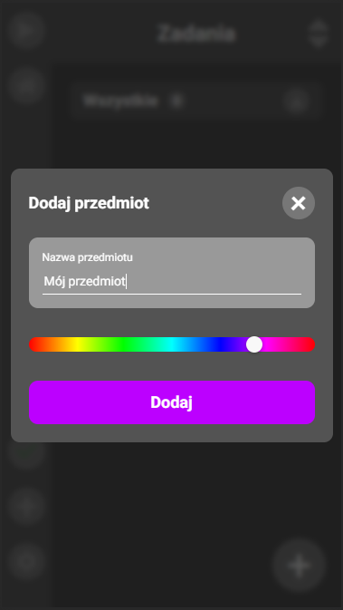
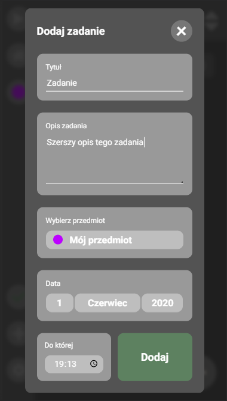
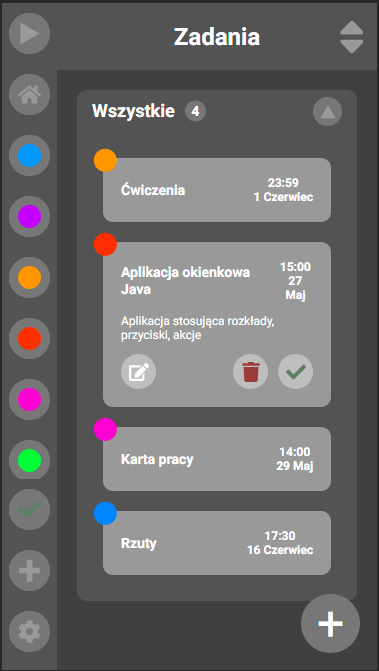
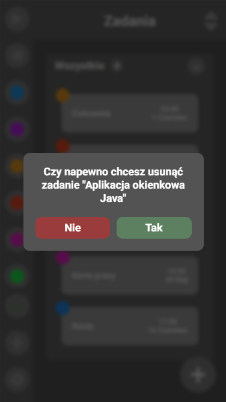
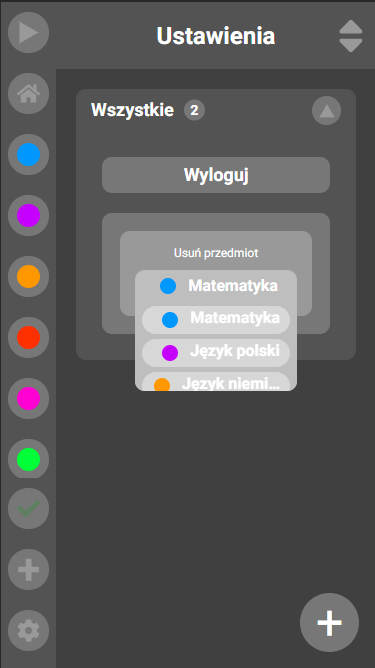

#Aplikacja organizująca zadania PWA

##Live: https://zadania-domowe.web.app/home
Aplikacja jest skierowana na urządzenia mobilne. 
Możliwe jest zainstalowanie aplikacji na naszym urządzeniu co ułatwia i usprawnia korzystanie z aplikacji. 
Przez integrację z firebase pozwala na dostęp do naszych zadań z każdego urządzenia.  
Każda akcja wykonana na zadaniach lub przedmiotach jest synchronizowana z bazą danych
w czasie rzeczywistym.

##Korzystanie z alikacji:

####Koniecznym jest zalogowanie się przez konto google.
####Następnym krokiem jest dodanie przedmiotów, a następnie zadań do przedmiotów.

####Aplikacja posiada możliwość dodawania, usuwania oraz edytowania przedmiotów jak i zadań.

